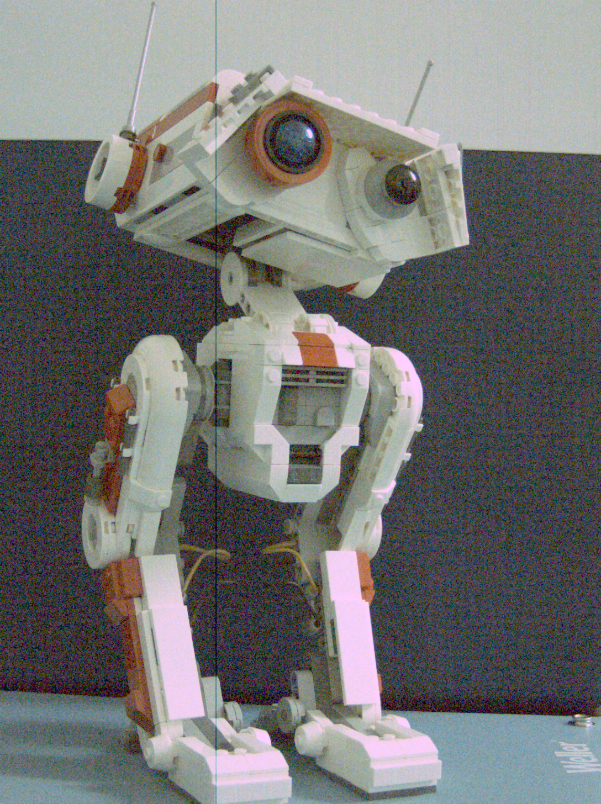
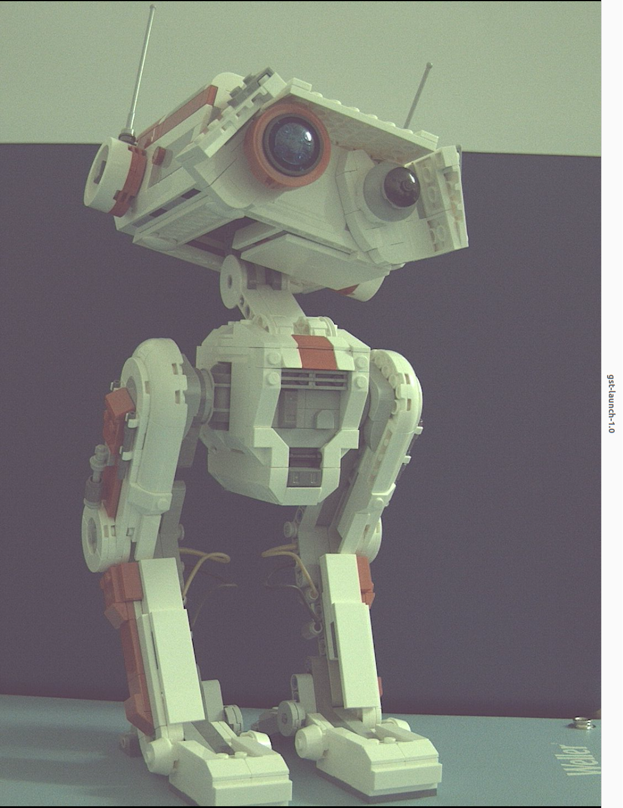

# IMX296 Driver for Jetson Orin Nano

A Linux V4L2 sensor driver and device-tree overlays that bring the Sony
IMX296 global-shutter sensor (as used on the **Raspberry Pi Global Shutter
Camera**) to the **NVIDIA Jetson Orin Nano** dev kit, using NVIDIA's
`tegracam` camera framework.

> **Status: early / experimental.** The sensor streams and basic controls
> (gain, exposure, frame rate, group hold) are implemented, but this has only
> been bring-up-tested by one person on one board. Expect bugs, and please
> report or send patches for anything you find. See [Known
> issues](#known-issues--limitations) below before relying on this for
> anything.

## Features

- V4L2 subdevice driver (`nv_imx296.c`) built against NVIDIA's `tegracam_core`
  framework, modeled on NVIDIA's own `nv_imx185.c` and the mainline
  `drivers/media/i2c/imx296.c`.
- Auto-detects color (IMX296LQ) vs. monochrome (IMX296LL) variants via the
  sensor's `SENSOR_INFO` register, or can be forced via a device-tree
  `compatible` string.
- Controls: gain, exposure, frame rate, group hold, fuse/sensor ID.
- Device-tree overlays for both CSI connectors on the Jetson Orin Nano dev
  kit carrier board (P3768): CAM0 (`-A`) and CAM1 (`-C`).
- Optional vertical-flip / horizontal-mirror device-tree properties.
- (**Does not work yet**) A minimal userspace ISP script (`scripts/imx296_isp_pipeline.py`) that
  applies real Raspberry Pi/libcamera tuning data (black level, CCM, gamma)
  to the raw Bayer capture, since NVIDIA's Argus ISP has no path to create a tuning files without being a nvidia partner.

## Repository layout

```
source/
  nvidia-oot/drivers/media/i2c/
    nv_imx296.c            Sensor driver
    imx296_mode_tbls.h      Register tables / mode definitions
    Makefile                 Adds nv_imx296.o to the existing i2c driver list
  hardware/nvidia/t23x/nv-public/overlay/
    tegra234-p3767-camera-p3768-imx296-A.dts   Overlay for CAM0 (J20)
    tegra234-p3767-camera-p3768-imx296-C.dts   Overlay for CAM1 (J21)
    Makefile                 Adds both .dtbo targets to the existing overlay list

scripts/                   Build / deploy / capture helper scripts (see below)
doc/
  imx296_registers.typ      Typst register reference (known/partial/unknown fields)
  external_sources/          Reference material this driver was derived from
                              (mainline imx296.c, libcamera cam helper, tuning JSON, etc.)
```

The files under `source/` mirror the exact path layout of NVIDIA's
`Linux_for_Tegra/source` tree, so they can be copied straight on top of it
(see below).

## Prerequisites

- A Jetson Orin Nano dev kit running JetPack 6.x (developed against **JetPack
  6.2.2**).
- NVIDIA's L4T kernel/BSP sources (`public_sources.tbz2`) for the matching
  JetPack release, from the [Jetson Linux
  archive](https://developer.nvidia.com/embedded/jetson-linux-archive).
- The matching `l4t-gcc` cross-compilation toolchain, from the [Jetson Linux
  Toolchain
  guide](https://docs.nvidia.com/jetson/archives/r34.1/DeveloperGuide/text/AT/JetsonLinuxToolchain.html).
- An IMX296-based sensor board (e.g. the Raspberry Pi Global Shutter Camera)
  wired to CAM0 or CAM1 on the 22-pin CSI connector.

## Build & install

### 1. Set up the toolchain

Add to your shell profile (adjust the path to where you extracted the
toolchain):

```bash
export CROSS_COMPILE=$HOME/nvidia/l4t-gcc/aarch64-none-linux-gnu/bin/aarch64-none-linux-gnu-
```

### 2. Overlay this repo's sources onto the L4T source tree

Copy the contents of `source/` on top of your extracted `Linux_for_Tegra/source`
tree, e.g.:

```bash
cp -r source/* ~/nvidia/nvidia_sdk/JetPack_6.2.2_Linux_JETSON_ORIN_NANO_TARGETS/Linux_for_Tegra/source/
```

### 3. Build the kernel module and device tree

```bash
./scripts/build_modules.sh   # builds nv_imx296.ko (and the rest of the i2c modules)
./scripts/build_dtbo.sh      # builds the imx296-A / imx296-C .dtbo overlays
```

Both scripts expect the JetPack 6.2.2 source layout referenced above; edit
the path at the top of each script if yours differs. `./scripts/clean_modules.sh`
cleans the kernel module build.

### 4. Deploy to the Jetson

```bash
./scripts/upload_camera_driver.sh   # scp's the .ko and .dtbo files to the target over SSH
```

This script assumes an SSH host alias named `nano-lan` and a
`~/camera_modules/` / `~/camera_dtbo/` layout on the target. Adjust it (or
just `scp` the files yourself) to match your setup.

### 5. Point the bootloader at the overlay

Edit `/boot/extlinux/extlinux.conf` on the Jetson to add a boot entry that
loads the overlay, e.g. for CAM1 (`-C`):

```
LABEL custom_camera_imx296_c
    MENU LABEL Custom Header Config: <CSI Camera IMX296-C>
    LINUX /boot/Image
    FDT /boot/dtb/kernel_tegra234-p3768-0000+p3767-0005-nv-super.dtb
    INITRD /boot/initrd
    APPEND ${cbootargs} root=PARTUUID=<your-root-partuuid> rw rootwait rootfstype=ext4 \
        mminit_loglevel=4 console=ttyTCU0,115200 firmware_class.path=/etc/firmware \
        fbcon=map:0 video=efifb:off console=tty0 efi=runtime pci=pcie_bus_perf \
        nvme.use_threaded_interrupts=1 nv-auto-config
    OVERLAYS /home/nvidia/camera_dtbo/tegra234-p3767-camera-p3768-imx296-C.dtbo
```

Set `DEFAULT custom_camera_imx296_c` (or the CAM0 equivalent) and reboot.

### 6. Load the driver and verify

```bash
./scripts/load_camera_module.sh   # sudo insmod camera_modules/nv_imx296.ko
sudo dmesg
```

Expect something like:

```
imx296 9-001a: probing IMX296 sensor
imx296 9-001a: mclk not in DT, assume sensor driven externally
imx296 9-001a: imx296_power_get: reset_gpio = 486, valid = 1
imx296 9-001a: tegracam sensor driver:imx296_v2.0.6
imx296 9-001a: imx296_power_on: gpio value after release = 1
imx296 9-001a: IMX296LQ (color) detected (sensor_info=0x4a00)
tegra-camrtc-capture-vi tegra-capture-vi: subdev imx296 9-001a bound
imx296 9-001a: IMX296LQ sensor detected and registered
```

## Capturing frames

Raw V4L2 capture:

```bash
./scripts/generate_raw_frame.sh   # v4l2-ctl capture -> frame.raw (1456x1088, RG10)
```

Decode a raw capture to PNG (per-CFA-plane previews, debayered RGB, and a
grayscale preview):

```bash
./scripts/raw_2_png.py frame.raw
```



The image above is rotated 90° clockwise relative to the sensor's native
capture orientation (no rotation correction is applied yet, see [Known
issues](#known-issues--limitations)). There is also a faint line running
top-to-bottom across the frame here; since the image is rotated 90°, that
is really a **black horizontal line running across the sensor's native
frame** that shows up on every capture. Not yet root-caused.

**(Does not work yet)**
Run the full raw -> debayer -> WB -> CCM -> gamma pipeline using real
libcamera/Raspberry Pi tuning data instead of Argus:

```bash
./scripts/imx296_isp_pipeline.py
```
You need OpenCV for python and numpy installed.

**(Works but gives dull colors)**
GStreamer live streaming over the network (`nvarguscamerasrc` -> JPEG/RTP on
the Jetson, receive with GStreamer on another machine):

```bash
./scripts/stream_imx296.sh     # on the Jetson (edit the target host/port first)
./scripts/receive_imx296.sh    # on the receiving machine
```
You may need this variable:
```
export __EGL_VENDOR_LIBRARY_FILENAMES=/usr/share/glvnd/egl_vendor.d/10_nvidia.json
```



Capture from the `nvarguscamerasrc`/Argus pipeline above (also rotated 90°
clockwise from the sensor's native orientation). The colors are not
correctly tuned: NVIDIA's Argus ISP has no supported path to create a tuning file without being a partner, so
there is no color matrix / white balance / tone curve calibrated for this
sensor. `scripts/imx296_isp_pipeline.py` is the attempt to work around this
by applying the real Raspberry Pi/libcamera tuning data outside of Argus,
but this is still being worked on.

## Known issues / limitations

- Only one resolution/mode is exposed (1456x1088 full array, 60 fps max);
  no cropped/binned modes yet.
- A **black horizontal line** (in the sensor's native, unrotated frame)
  shows up across every raw capture; see `doc/images/frame_rgb.png`. Cause
  not yet identified.
- `nvarguscamerasrc`/Argus output is not color-tuned, since there is no
  supported way to load a third-party ISP tuning file into Argus for a
  sensor NVIDIA doesn't ship a profile for; see
  `doc/images/nvarguscamerasrc_pipeline.png`.
- No HDR, EEPROM, or OTP support.
- `#define DEBUG` is currently left enabled in `nv_imx296.c`, which dumps the
  full register set (and adds extra delay) on every mode-set/start/stop.
  Useful for bring-up, but noisy and slow for normal use.
- Verified against JetPack 6.2.2 on the Jetson Orin Nano dev kit only. Other
  L4T versions or Jetson boards are untested.

## Contributing

This is very much a work in progress, put together by trial and error
against sparse/undocumented sensor registers. Issues, corrections, and pull
requests are very welcome, especially from anyone with Sony IMX296 datasheet
access or mainline `imx296.c`/tegracam experience.

## References

- Mainline Linux driver: `drivers/media/i2c/imx296.c` by Laurent Pinchart
  (mirrored in `doc/external_sources/linux_imx296.c`).
- libcamera IMX296 camera helper (`cam_helper_imx296.cpp`), mirrored in
  `doc/external_sources/`.
- `doc/imx296_registers.typ`: register-by-register reference distilled from
  this driver's source comments, marked known/partial/unknown per field.

## License

GPL-2.0, see [LICENSE](LICENSE).
